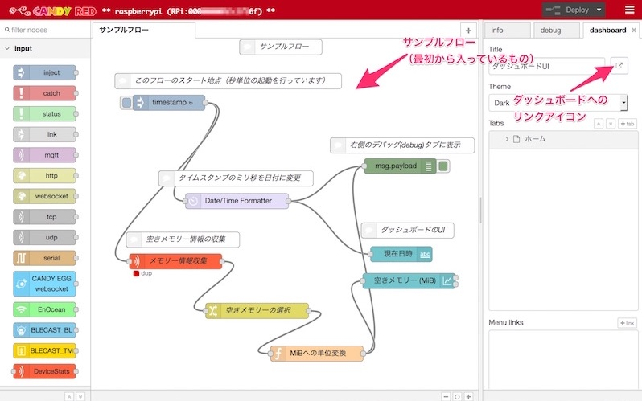

[🔙目次ページへ戻る](README.md)

ltepi2-serviceをインストールすると、ラズパイ上にNode-REDベースのフローエディターである[CANDY RED](https://github.com/dbaba/candy-red)もインストールされます。通常のNode-REDとしての機能のほか、CANDY EGGクラウドサービスと連携して手軽にクラウドとのやりとりを行うアプリケーションを作成することができます。

初回インストール時に[CANDY RED](https://github.com/dbaba/candy-red)を **インストールしていない場合(`CANDY_RED=0`を指定してインストールした場合)** は、以下の手順で追加することができます。

### CANDY REDアプリケーションのインストール
まず最初に、ltepi2-serviceを停止し、LANケーブルまたはWiFiでインターネットに接続します。これは、ダウンロードにかかる通信をLTEではなく有線・無線LANにて行うようにするためです。

はじめに、以下のコマンドを実行してltepi2-serviceを停止します。

```bash
$ sudo systemctl stop ltepi2
```

続いて、ネットワークの確認を行います。ラズパイにコマンドラインからアクセスして、以下のコマンドを実行します。

```bash
$ curl --head https://registry.npmjs.org
```

以下のように結果が返って来るようであれば、正しくインターネットに接続できています。

```
HTTP/1.1 200 OK
server: CouchDB/1.5.0 (Erlang OTP/R16B03)
Content-Type: application/json
Cache-Control: max-age=300
Content-Length: 262
Accept-Ranges: bytes
Date: Fri, 16 Sep 2016 05:19:25 GMT
Via: 1.1 varnish
Age: 108
Connection: keep-alive
X-Served-By: cache-hkg6823-HKG
X-Cache: HIT
X-Cache-Hits: 1
X-Timer: S1474003165.840989,VS0,VE0
Vary: Accept-Encoding
```

続いて、Node.jsを入れ替えます。Raspbian 4.1以降ではNode-REDがプリインストールされていますのでNode.jsもすでに入っています。しかし、[CANDY RED](https://github.com/dbaba/candy-red)インストール時に追加するアドオンを用意するときに、プリインストールされたNode.jsでは解決できないエラーが発生してしまいます。これを避けるため、Node.jsを入れ替えるようにします。

Raspberry Pi Model B+をお使いの場合は、以下のコマンドを実行します。
```bash
$ sudo apt-get update -y
$ sudo apt-get upgrade -y
$ wget http://node-arm.herokuapp.com/node_archive_armhf.deb
$ sudo dpkg -i node_archive_armhf.deb
$ sudo apt-get install -y python-dev python-rpi.gpio bluez libudev-dev
```

Raspberry Pi2をお使いの場合は、以下のコマンドを実行します。
```bash
$ sudo apt-get update
$ sudo apt-get upgrade
$ curl -sL https://deb.nodesource.com/setup_0.12 | sudo bash -
$ sudo apt-get install -y python-dev python-rpi.gpio bluez nodejs libudev-dev
```

続いて`npm`のキャッシュをクリアしておきましょう。そうしないと、古いバージョンを見てしまうかもしれないからです。
```
$ sudo npm cache clean
```

それでは[CANDY RED](https://github.com/dbaba/candy-red)をインストールしましょう。インストールには、30分ほどかかります。
```bash
$ sudo NODE_OPTS=--max-old-space-size=128 npm install -g --unsafe-perm candy-red
```

### CANDY REDの動作確認
それでは動作しているかを確認します。
```bash
$ sudo systemctl status candy-red
```

上記を実行して、以下のような結果が得られれば問題ありません。

    ● candy-red.service - CANDY RED Gateway Service, version:
       Loaded: loaded (/lib/systemd/system/candy-red.service; enabled)
       Active: active (running) since Wed 2016-01-27 02:11:31 UTC; 594ms ago
     Main PID: 3612 (bash)
       CGroup: /system.slice/candy-red.service
               ├─3612 bash /usr/local/lib/node_modules/candy-red/services/start_systemd.sh
               └─3618 node --max-old-space-size=128 /usr/local/lib/node_modules/candy-red/dist/index.j...

    Jan 27 02:11:31 my-ltepi systemd[1]: Starting CANDY RED Gateway Service, version:...
    Jan 27 02:11:31 my-ltepi systemd[1]: Started CANDY RED Gateway Service, version:.
    Jan 27 02:11:31 my-ltepi start_systemd.sh[3612]: logger: Activating Bluetooth...
    Jan 27 02:11:31 my-ltepi start_systemd.sh[3612]: Can't get device info: No such device
    Jan 27 02:11:31 my-ltepi start_systemd.sh[3612]: logger: Starting candy-red...

なお、この時点で、端末を再起動したときには、自動的に[CANDY RED](https://github.com/dbaba/candy-red)が起動するようになります。

続いて、ltepiを再度起動しましょう。
```bash
$ sudo systemctl start ltepi2
```

1〜2分ほどで、モデムが起動しインターネットに接続します。以下のコマンドを実行して接続状況を確認することができます。

```bash
$ ip route | grep default
```

以下のように`usb0`と出ていれば成功です。
```
default via 192.168.225.1 dev usb0  metric 204
```

### CANDY REDへのブラウザー接続
最後にブラウザーから接続してみましょう。ラズパイがつながっている有線または無線LANと同じネットワークにあるコンピューターのブラウザーで以下のアドレスを入力してページを表示させてみてください。
```
http://raspberrypi.local:8100
```
もしラズパイのホスト名を変更していた場合は、「ホスト名.local」か、企業や学校などのネットワーク環境に応じて決められたホスト名を「raspberrypi.local」の代わりに指定します。名前で繋がらないときは、IPアドレスを指定しましょう。

接続に成功すると、以下のようなページが表示されます（通信環境が悪い場合は英語版の表示が出ることがありますが表記以外は同一のものです）。


このフローはあくまで参考のためのものです。これを削除してご自身のフローを作成することができます。

### CANDY REDへコマンドラインから新しいノードを追加するには

```
cd /opt/candy-red/.node-red
sudo npm install ノードモジュール名
```

ノードモジュールは、こちらから検索できるノードをご利用ください。「ノードモジュール名」には、`
node-red-contrib-cache`など、タイトルで表示される文字列を指定します。

* [インストール前に準備するもの](インストール前に準備するもの.md)
* [インストール方法](インストール方法.md)
* [インストール方法（上級者向け用途の場合）](インストール方法＜上級者向け用途＞.md)
* [インストール後の作業](インストール後の作業.md)
* [ltepi2-serviceの起動と停止](ltepi2-serviceの起動と停止.md)
* [CANDY-REDへのブラウザー接続](CANDY-REDへのブラウザー接続.md)
* [うまく動かない時は](うまく動かない時は.md)

---
© 2017 CANDY LINE INC. [CC-BY-NC-SA 4.0](https://creativecommons.org/licenses/by-nc-sa/4.0/)
