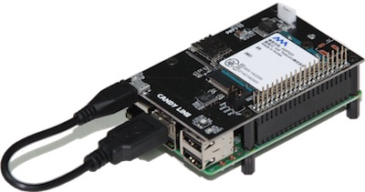

[🔙目次ページへ戻る](README.md)

LTEPi for Dは、ラズパイ B+やラズパイ 2 Model Bに取り付けが可能なLTE/3G通信モジュールを搭載した基板です。NTT DOCOMO及びNTT DOCOMOの回線を利用するMVNOのSIMを利用することができます。

LTEPi for Dをラズパイ 3にも取り付けることは可能ですが、条件に見合ったACアダプターが必要となります。また、ACアダプターのためのDCジャックも取り付けていただく必要があります。というのも電源の接続を誤りますとラズパイ 3や、LTEPi for Dの基板を壊してしまいますので、出荷時の状態では容易にラズパイ 3に接続できないように設計されています。ラズパイ 3向けDCジャックの取り付け方法については、[ラズパイ3対応方法](📌Raspberry-Pi3対応方法.md)のページをご覧ください。

* [対応ハードウェア](対応ハードウェア.md)
* [対応OS](対応OS.md)
* [ltepi2-serviceとは](ltepi2-serviceとは.md)

---
COPYRIGHT © 2016 CANDY LINE, Inc. [CC-BY-NC-SA 4.0](https://creativecommons.org/licenses/by-nc-sa/4.0/)
