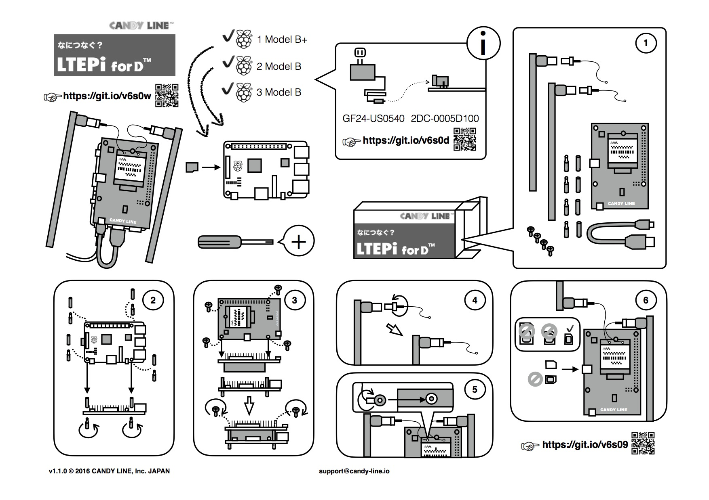

# [LTEPi for D](http://www.candy-line.io/proandsv.html#ltepiford)利用ガイド

1. [LTEPi for Dって何？](LTEPi-for-Dって何？.md)
  1. [対応ハードウェア](対応ハードウェア.md)
  1. [対応OS](対応OS.md)
  1. [ltepi2-serviceとは](ltepi2-serviceとは.md)
1. LTEPi for Dのセットアップ (ltepi2-serviceのインストール)
  1. [インストール前に準備するもの](📌インストール前に準備するもの.md)
  1. [インストール方法](インストール方法.md)
  1. [CANDY REDのインストール方法](CANDY-REDのインストール方法.md)
1. [ltepi2-serviceのバージョンアップ](バージョンアップ方法.md)
1. [ltepi2-serviceのアンインストール](アンインストール方法.md)
1. [コマンドラインツール](コマンドラインツール.md)
  1. [APNの表示](APNの表示.md)
  1. [APNの設定](APNの設定.md)
  1. [ネットワーク状態の表示](ネットワーク状態の表示.md)
  1. [SIM認識状態の表示](SIM認識状態の表示.md)
  1. [モデム情報の表示](モデム情報の表示.md)
1. 設定・その他
  1. [GPIOピンマッピング](GPIOピンマッピング.md)
  1. [LED点滅のON/OFF](LED点滅のON-OFF.md)
  1. [サービス停止完了時間の短縮](サービス停止完了時間の短縮.md)
  1. [対SDカード破損方法](対SDカード破損方法.md)
  1. [Node-REDからの移行方法](Node-REDからの移行方法.md)
  1. [Raspberry Pi3対応方法](📌Raspberry-Pi3対応方法.md)

### 組み立ての手引き（印刷版）

### 組み立ての手引き（動画版）

---
COPYRIGHT © 2016 CANDY LINE, Inc. [CC-BY-NC-SA 4.0](https://creativecommons.org/licenses/by-nc-sa/4.0/)
