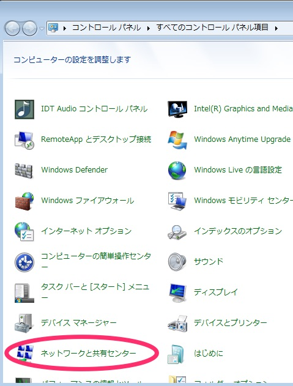
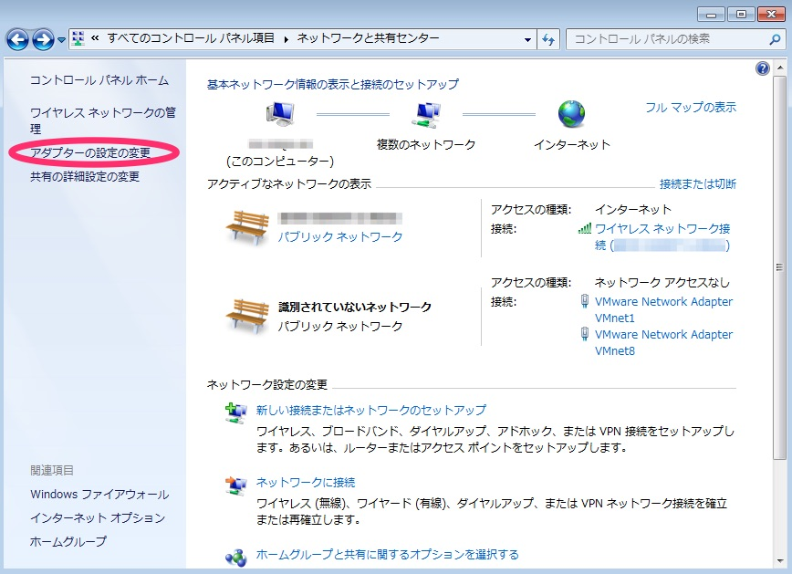
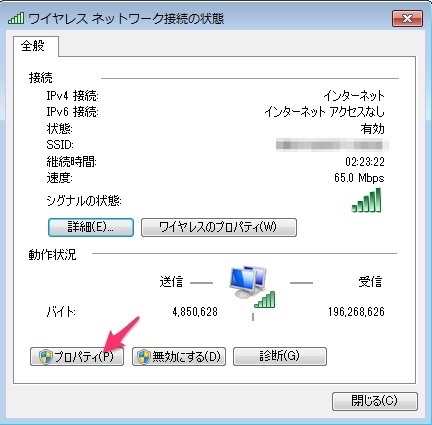
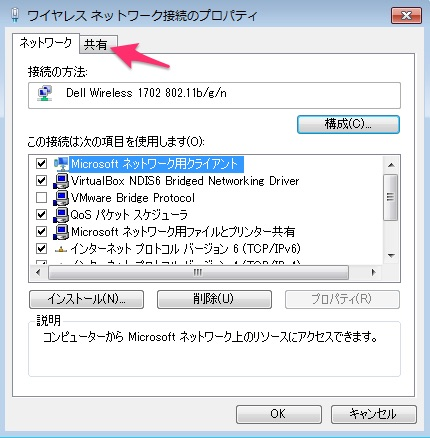
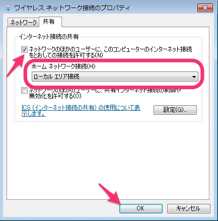
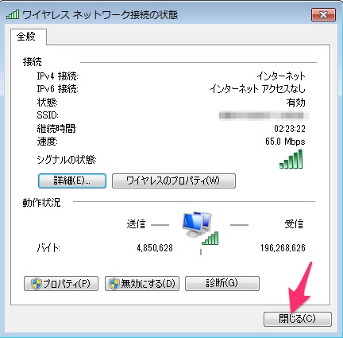

[🔙目次ページへ戻る](README.md)

# Windows7で固定IPのラズパイと簡単につなぐには

ラズパイとパソコンを直接LANケーブルで接続すると、多くの場合は自動的に`raspberrypi.local`（ラズパイのホスト名を変更していない場合）と言う名前でラズパイのアドレスを指定することができます。しかし、オフィスや学校などでご利用されているパソコンでは、名前によるアドレス指定がうまく動作しないためにラズパイへつながらないこともあります。そのような場合は、[固定IPをラズパイに設定](https://www.google.co.jp/#q=固定IPをラズパイに設定&tbs=qdr:y)してアクセスするような方法をとります。

ただ、固定IPを使用してパソコンとラズパイをつなぐと、パソコン側のネットワーク設定を変えたり、ラズパイの設定を変更したりするなどラズパイへつなごうとするたびに余計な手間が増えてしまいがちです。そのような手間を軽減するため、[LTEPi for D](https://www.candy-line.io/製品一覧/ltepi-for-d/)向けのセットアップしたラズパイでは、より簡便な方法を提供しています。ただし、2017年1月30日以降にセットアップされた場合か、それ以降にバージョンアップを行われた場合に利用できる方法ですので、もしそれ以前にセットアップされた場合で以下の方法をお試しになりたい時は、[ltepi2-serviceのバージョンアップ](バージョンアップ方法.md)をまずは行ってください。

## 設定の仕方

### インターネット接続を共有しましょう

ラズパイからパソコンを通して、無線LANのインターネットへ接続できるようにします。これは、ラズパイ側でアップデートや追加といった操作を実現できるようにするためです。また、Windowsはインターネット接続共有機能を有効にすると自動的に`192.168.137.1`と言うアドレスをパソコンに割り当てます。この性質を利用して、ラズパイの固定IPを`192.168.137.2`から`192.168.137.254`の間に指定すると、パソコン側の設定の手間を減らすことができます。

Windows7でインターネット接続共有機能を有効にするには、「コントロールパネル」を開き、「ネットワークと共有センター」を探してクリックしましょう。この時、無線LANでインターネットに出られるようにパソコンを設定しておいてください。

そうすると次の図のような画面が出ます。

この画面では、「アダプターの設定の変更」のリンクをクリックします。

「ワイヤレスネットワーク接続の状態」と言うウィンドウが出ますので、下にある「プロパティ」をクリックします。

「ワイヤレスネットワーク接続のプロパティ」が表示されたら、「共有」タブをクリックしましょう。

このウィンドウで「ネットワークのほかのユーザーに、このコンピューターのインターネット接続をとおしての接続を許可する」にチェックを入れます。加えて、「ホームネットワーク接続」には「ローカルエリア接続」を選択しましょう。この2つを確実に行うようにしてください。

変更したら「OK」を押してください。

最後にこのウィンドウの「閉じる」をクリックしましょう。これで設定が反映されます。

### IPアドレス設定をダウンロードしましょう

「[boot-ip.windows.json](https://raw.githubusercontent.com/CANDY-LINE/ltepi2-service/master/systemd/boot-ip.windows.json)」をダウンロードしてファイル名を「boot-ip.windows.json」として保存しましょう。

うまくダウンロードできない時は、メモ帳などで中身を貼り付けて、「boot-ip.windows.json」として保存しましょう。

## ラズパイで使っているSDカードにファイルを保存

続いて、保存したファイルを[LTEPi for D](https://www.candy-line.io/製品一覧/ltepi-for-d/)向けのセットアップをしたラズパイのSDカードに保存しましょう。

まずは、そのSDカードをお使いのパソコンへ差し込んでください。SDカードスロットがない場合は、USBのSDカードアダプターなどをお使いください。

SDカードが認識されると、`boot`というフォルダーが見えるようになります。その場所に、作成したファイル（`boot-ip.windows.json`）をコピーしましょう。

コピーを行ったら、SDカードを取り出します。

### ラズパイとパソコンをLANケーブルでつなぎましょう

ラズパイとパソコンをLANケーブルで接続しましょう。また、ラズパイにUSBケーブルを接続して電源を入れましょう。
パソコンは、無線LAN経由でインターネットに接続できる状態にしておきましょう。

### ラズパイにアクセスしてみましょう

設定が反映されていると、ラズパイには`192.168.137.200`のアドレスでアクセスできるようになります。

ブラウザーを開いて「`http://192.168.137.200:8100`」へアクセスしてみましょう。[CANDY RED](https://github.com/dbaba/candy-red)の画面が表示されれば成功です！

---
© 2017 CANDY LINE INC. [CC-BY-NC-SA 4.0](https://creativecommons.org/licenses/by-nc-sa/4.0/)
